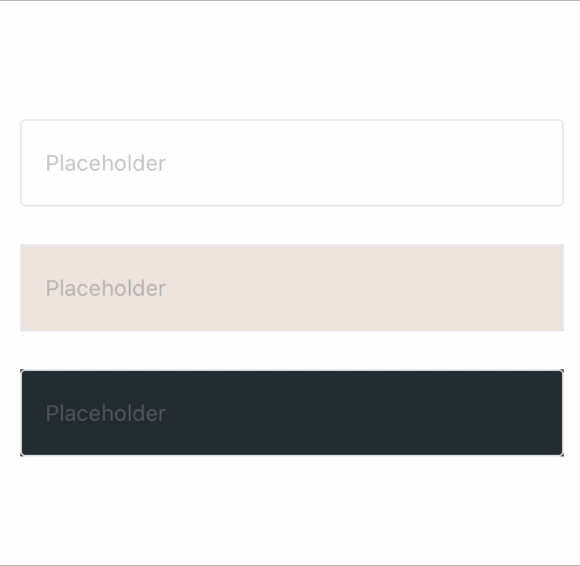
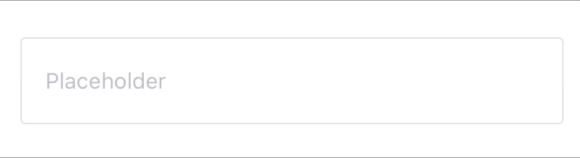
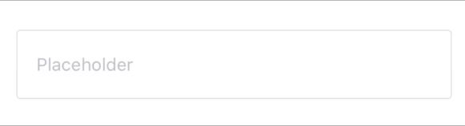

# RTFInput

[](https://travis-ci.org/n.kusyumov@mail.ru/RTFInput)
[](https://cocoapods.org/pods/RTFInput)
[](https://cocoapods.org/pods/RTFInput)
[](https://cocoapods.org/pods/RTFInput)

## Demo


## Example

To run the example project, clone the repo, and run `pod install` from the Example directory first.

## Installation

### Cocoapods

RTFInput is available through [CocoaPods](https://cocoapods.org). To install
it, simply add the following line to your Podfile:

```ruby
pod 'RTFInput'
```

Then, run the following command:

```ruby
$ pod install
```

## Quick Start

**1. Import RTFInput**

Import RTFInput module where you want to use it:

```swift
import RTFInput
```
**2. Initialization**

Create `RTFInput` by code, using initializer.

```swift
lazy var textInputView = RTFInput()
```

**2. Customize**

You can easily edit any of the elements as you want! All you need is to change setting.
`RTFInputSetting` is required for `RTFInput` to work properly, which concise all the settings and customizations together into one single builder function. Here are the steps:

1. Initialize `RTFInputSetting` instance by using `RTFInputSetting.Builder`
2. Add features & customizations
3. Setup `RTFInput` by created `RTFInputSetting` instance

```swift
lazy var firstTextInputView: RTFInput = {
    let textInputView = RTFInput()
    let setting = RTFInputSettings.Builder.instance()
        // Add Your customize code here
        .build()
    textInputView.setup(setting: setting)
    return textInputView
}()
```

**- change theme**

<p align="center">
    
</p>

You can easily change the theme, just specify one of the values:
- standard (Default)

```swift
.theme(.standard)
```

- dark

```swift
.theme(.dark)
```

- light

```swift
.theme(.light)
```

Please note that if theme and color customization, e.g. textColor, are both setup in builder, the text color from theme will be ignored.

**- change colors**

<p align="center">
    
</p>

You can change all elements You want. Background, text, placeholder and other.

just add next code:

**to change plaseholder color**
```swift
.placeholderColor(.red)
```

**to change text color**
```swift
.textColor(.blue)
```

**to change background color**
```swift
.backgroundColor(.yellow)
```

**to change cursor color**
```swift
.cursorColor(.purple)
```

**to change floating hint text color**
```swift
.accentColor(.brown)
```

**to change warning text color**
```swift
.warningColor(.green)
```

**- change secure value**

<p align="center">
    
</p>

Also you can change the secure value to your text

```swift
.secure(true)
```

**- configure warnings**

<p align="center">
    
</p>

You can configure the error message and action if You need it.
- number
- phone
- password
- email
- index
- cardNumber
- cardValidity
- CVV

or You can write your custom regular expression

- regex(pattern: String)

```swift
.inputType(
    .email,
    onViolated: (
        message: "Invalid email",
        callback: nil
    )
)
```

## Author

Nikita Kusyumov, n.kusyumov@mail.ru

## License

RTFInput is available under the MIT license. See the LICENSE file for more info.
